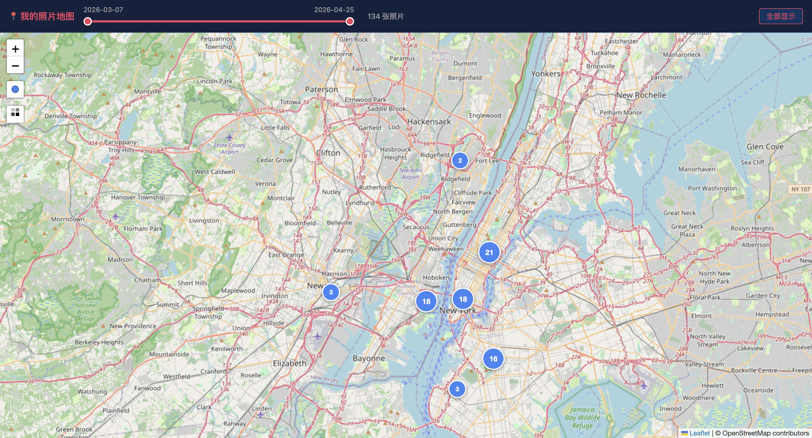
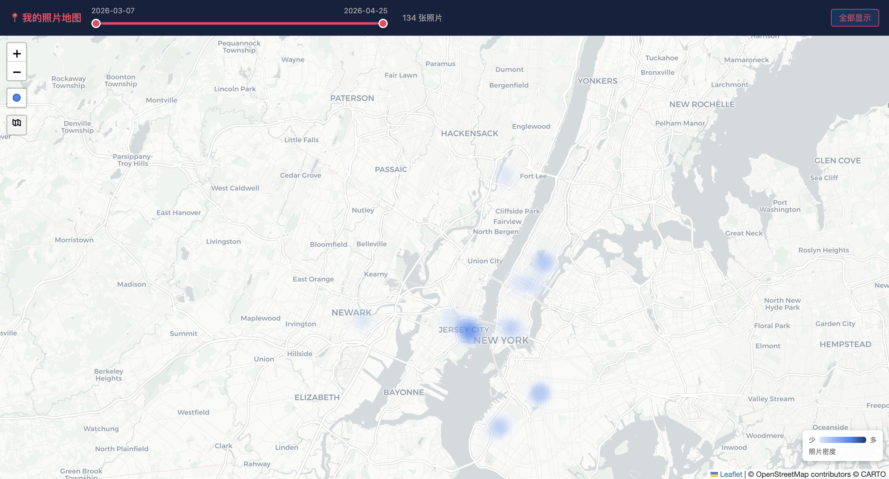

# 我的照片地图 · Photo Map

把 iPhone/Android/Google Photos 里的照片导入自建 [Immich](https://immich.app/) 服务，然后在交互式世界地图上可视化所有带 GPS 的照片。

## 效果预览

**聚合模式** — 点击聚合圆展开右侧缩略图面板



**热力图模式** — 同位置切换热力图，右下角显示密度图例



- 顶栏时间轴滑块：按日期范围过滤照片
- 点击城市聚合圆：展开右侧面板，显示该地点的缩略图
- 左侧工具栏：切换热力图模式 / 更改标记颜色
- 点击缩略图：跳转 Immich 查看原图

---

## 工具栈

| 层级 | 工具 |
|---|---|
| 照片存储 | [Immich](https://immich.app/) v2.7.5（Docker 自建） |
| 批量上传 | [Immich CLI](https://immich.app/docs/features/command-line-interface) / [immich-go](https://github.com/simulot/immich-go)（Google Takeout 适配） |
| GPS 导出 | `export_gps.py`（调用 Immich REST API，输出 `gps_data.json`） |
| 地图渲染 | [Leaflet.js](https://leafletjs.com/) 1.9.4 |
| 聚合 | [Leaflet.MarkerCluster](https://github.com/Leaflet/Leaflet.markercluster) 1.5.3 |
| 热力图 | [Leaflet.heat](https://github.com/Leaflet/Leaflet.heat) |
| 底图 | OpenStreetMap / CartoDB Light（免费，无需 API Key） |

---

## 快速开始

### 1. 部署 Immich

```bash
# 参考官方文档：https://immich.app/docs/install/docker-compose
mkdir ~/immich && cd ~/immich
wget -O docker-compose.yml https://github.com/immich-app/immich/releases/latest/download/docker-compose.yml
wget -O .env https://github.com/immich-app/immich/releases/latest/download/example.env
docker compose up -d
# 访问 http://localhost:2283，注册账号并生成 API Key
```

### 2. 上传照片

```bash
# 用 Immich CLI 上传
npm install -g @immich/cli
immich login http://localhost:2283 <YOUR_API_KEY>
immich upload /path/to/photos

# 或用 immich-go 上传 Google Takeout 压缩包
immich-go upload gp-takeout --server http://localhost:2283 --api-key <KEY> /path/to/takeout
```

### 3. 导出 GPS 数据

```bash
# 登录后 CLI 会把凭据写入 ~/.config/immich/auth.yml，脚本自动读取
python3 export_gps.py
# 输出：gps_data.json（含经纬度、日期、城市、国家、资产 ID）
```

### 4. 打开地图

```bash
# 启动本地服务器（避免浏览器 CORS 限制）
python3 -m http.server 8080
# 在浏览器打开
open http://localhost:8080/map.html
```

> **注意**：`map.html` 中硬编码了 `IMMICH_URL` 和 `API_KEY` 常量（第 239-240 行），克隆后请替换为自己的值。

---

## 文件结构

```
photo-analysis/
├── export_gps.py       # 从 Immich API 提取 GPS 点 → gps_data.json
├── map.html            # 单文件交互地图（Leaflet + 纯 HTML/JS）
├── gps_data.json       # 已导出的 GPS 数据（.gitignore 忽略，需自行生成）
└── image/
    ├── map_nyc.png     # 聚合模式截图
    └── heatmap_nyc.png # 热力图模式截图
```

---

## gps_data.json 格式

```json
[
  {
    "lat": 40.641742,
    "lng": -74.003594,
    "date": "2026-04-25",
    "city": "Brooklyn",
    "state": "New York",
    "country": "United States of America",
    "id": "<immich-asset-uuid>"
  }
]
```

缩略图通过 `GET http://localhost:2283/api/assets/<id>/thumbnail?size=preview` 实时从 Immich 拉取，**不存储在本仓库**。
